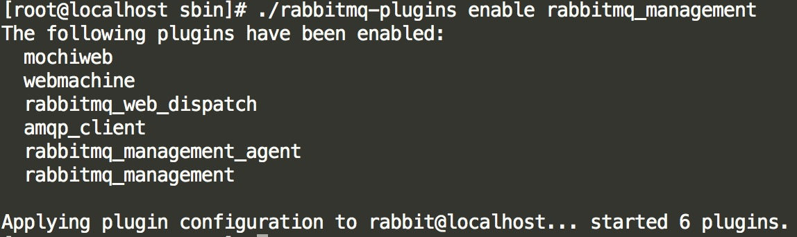

<!-- MarkdownTOC levels="2,3,4" autolink="true" autoanchor="true" style="ordered" uri_encoding="false" -->

1. [Spring Cloud](#spring-cloud)
    1. [简介](#简介)
    1. [Eureka注册中心](#eureka注册中心)
    1. [Provider创建](#provider创建)
    1. [Consumer创建-Ribbon方式](#consumer创建-ribbon方式)
    1. [Consumer创建-Feign方式](#consumer创建-feign方式)
    1. [断路器-Hystrix](#断路器-hystrix)
        1. [ribbon+RestTemplate方式中使用断路器](#ribbonresttemplate方式中使用断路器)
        1. [feign中使用断路器](#feign中使用断路器)
        1. [Hystrix Dashboard](#hystrix-dashboard)
    1. [路由Zuul](#路由zuul)
        1. [路由转发](#路由转发)
        1. [Zuul过滤器](#zuul过滤器)
    1. [多注册中心](#多注册中心)
    1. [配置管理中心config](#配置管理中心config)
    1. [服务追踪Zipkin](#服务追踪zipkin)
    1. [RabbitMQ](#rabbitmq)
    1. [Spring Cloud Bus消息总线](#spring-cloud-bus消息总线)

<!-- /MarkdownTOC -->


<a id="spring-cloud"></a>
## Spring Cloud
<a id="简介"></a>
### 简介
1. Spring Cloud是基于Spring Boot的一整套实现微服务的框架。提供了微服务开发所需的配置管理、服务发现、断路器、智能路由、微代理、控制总线、全局锁、决策竞选、分布式会话和集群状态管理组件。
2. [官网](https://projects.spring.io/spring-cloud/)
3. dubbo和Spring Cloud对比

    

<a id="eureka注册中心"></a>
### Eureka注册中心
1. 创建项目，选择依赖

    
2. 修改pom.xml（springboot和springcloud版本号）
3. 修改核心配置文件

    
4. 程序入口启动类添加注解

    
5. 启动访问

    

<a id="provider创建"></a>
### Provider创建
1. 创建Provider，添加依赖

    
2. 修改pom.xml（springboot和springcloud版本号）
3. 修改application.properties

    
4. 在应用启动类中添加注解

    
5. 启动provider，刷新注册中心页面，可查看注册的服务

    

<a id="consumer创建-ribbon方式"></a>
### Consumer创建-Ribbon方式
Spring cloud的服务消费者Consumer有两种服务调用方式，一种是ribbon+restTemplate，另一种是feign。
ribbon是一个负载均衡客户端。Feign默认集成了ribbon。

1. 基于ribbon+restTemplate的服务调用架构示意图

    
2. 创建项目、添加依赖

    
3. 修改pom.xml（springboot和springcloud版本号）
4. 配置文件application.properties

    
5. 在springboot启动类中添加注解、创建restTemplate

    
6. 创建service、controller
    编写HelloService.java(在service实现类中完成服务调用)

    

    

<a id="consumer创建-feign方式"></a>
### Consumer创建-Feign方式
该方式是对RestTemplate方式的封装（无需创建该对象，并通过该对象调用服务），直接在Consumer的Service接口中通过Feign注解完成服务的调用。
简而言之：
* Feign 采用的是基于接口的注解
* Feign 整合了ribbon
1. 创建项目、添加依赖

    
2. 修改pom.xml（springboot和springcloud版本号）
3. 核心配置文件application.properties

    
4. 在应用启动类中添加注解

    
5. 编写service接口和controller代码

    
6. 运行测试
7. 与ribbon+rest对比
    * 依赖不同
    * 注解不同
    * 加载对象
        1. ribbon需要加载RestTemplate
        2. feign无需手动加载

<a id="断路器-hystrix"></a>
### 断路器-Hystrix
如果单个服务出现问题，由于服务与服务之间的依赖性，故障会传播，会对整个微服务系统造成灾难性的严重后果，这就是服务故障的“雪崩”效应。
为了解决这个问题，业界提出了断路器模型。
当对特定的服务的调用的不可用达到一个阈值（Hystrix 是5秒20次） 断路器将会被打开。断路打开后，可以避免连锁故障，fallback方法可以直接返回一个固定值。    


<a id="ribbonresttemplate方式中使用断路器"></a>
#### ribbon+RestTemplate方式中使用断路器
1. 创建项目、添加依赖

    
2. 修改pom.xml（springboot和springcloud版本号）
3. 编写核心配置文件，同ribbon项目

    
4. 启动类添加注解

    
5. HelloService.java
        

<a id="feign中使用断路器"></a>
#### feign中使用断路器
1. 手动添加hystrix的依赖（在mvnRepository找即可）
    
    
2. 核心配置文件，开启Feign自带的断路器

    
3. 添加service实现、修改service接口
    * 添加service实现

        
    
    * 修改service接口

        

<a id="hystrix-dashboard"></a>
#### Hystrix Dashboard
断路器仪表盘:断路器状态监控界面
1. 添加两个依赖

    
2. 在启动类上添加注解

    
3. 界面如下

    

<a id="路由zuul"></a>
### 路由Zuul
Zuul的主要功能是路由转发和过滤器。路由功能是微服务的一部分，比如／api/a转发到到a服务，/api/b转发到到b服务。zuul默认和Ribbon结合实现了负载均衡的功能。

<a id="路由转发"></a>
#### 路由转发
1. 架构示意图

    
2. 创建项目，添加依赖

    
3. 添加注解

    
4. 修改核心配置文件

    
5. 测试
    启动注册中心、provider、consumer和zuul项目，访问[http://localhost:8087/a/getinfo](http://localhost:8087/a/getinfo) 或 [http://localhost:8087/b/getinfo](http://localhost:8087/b/getinfo)

<a id="zuul过滤器"></a>
#### Zuul过滤器
1. 编写过滤器类继承ZuulFilter，并重写当中的方法。
    方法解释：
    
    
2. Debug启动Consumer项目并在controller方法上加断点，看是否请求相应的项目。
   访问路径：[http://localhost:8087/a/getinfo](http://localhost:8087/a/getinfo) 或 [http://localhost:8087/b/getinfo](http://localhost:8087/b/getinfo)

<a id="多注册中心"></a>
### 多注册中心
当成千上万个服务向注册中心注册的时候，它的负载是非常高的，这在生产环境上是不太合适的，如何将Eureka Server集群化？通过运行多个Eureka实例，使其更具有高可用性即可。

1. 核心配置文件
    1. application-peer1.properties
        ```text
        # 运行端口号
        server.port=8088
        
        # 指定注册中心实例名
        eureka.instance.hostname=localhost
        
        # 应用名称
        spring.application.name=springcloud-reg1
        
        #注册当前服务
        eureka.client.service-url.defaultZone=http://localhost:8089/eureka
    
        ```
    2. application-peer2.properties
        ```text
        # 运行端口号
        server.port=8089
        
        # 指定注册中心实例名
        eureka.instance.hostname=localhost
        
        # 应用名称
        spring.application.name=springcloud-reg2
        
        #注册当前服务
        eureka.client.service-url.defaultZone=http://localhost:8088/eureka
        ```
    3. application.properties
        ```text
        # 指定默认加载的配置文件
        spring.profiles.active=peer1
        ```
2. 指定注册中心

    在服务提供者、消费者、代理方等项目指定多个注册中心即可
    `eureka.client.service-url.defaultZone=http://localhost:8088/eureka,http://localhost:8089/eureka`
3. 打包运行
    1. 打包命令`mvn package`
    2. 运行
        ```shell
        java -jar xxxx.jar  --spring.profiles.active=peer1
        java -jar xxxx.jar  --spring.profiles.active=peer2
        ```

<a id="配置管理中心config"></a>
### 配置管理中心config
在分布式系统中，由于服务数量巨多，为了方便服务配置文件统一管理，实时更新，所以需要分布式配置中心组件。在Spring Cloud中，有分布式配置中心组件spring cloud config ，它支持配置服务放在配置服务的内存中（即本地），也支持放在远程SVN或Git仓库中。在spring cloud config 组件中，分两个角色，一是config server，二是config client。

1. 配置文件统一管理示意图
    
    
2. 创建服务端
    1. 创建项目，添加依赖

        
    2. 修改pom文件（核对版本号），手动添加svnkit依赖（mvnRepository查找）
        ```xml
        <dependency>
            <groupId>org.tmatesoft.svnkit</groupId>
            <artifactId>svnkit</artifactId>
        </dependency>
        ```
    3. 在启动类上添加注解
        ```
        package com.cylib;
        
        import org.springframework.boot.SpringApplication;
        import org.springframework.boot.autoconfigure.SpringBootApplication;
        import org.springframework.cloud.client.discovery.EnableDiscoveryClient;
        import org.springframework.cloud.config.server.EnableConfigServer;
        
        @SpringBootApplication
        @EnableDiscoveryClient
        @EnableConfigServer
        public class Springcloud10ConfigServerApplication {
        
            public static void main(String[] args) {
                SpringApplication.run(Springcloud10ConfigServerApplication.class, args);
            }
        }
        ```
    4. 修改核心配置文件application.properties
        ```text
        # 运行端口号
        server.port=8090
        
        # 应用名称
        spring.application.name=config-server
        
        # 注册中心路径
        eureka.client.service-url.defaultZone=http://localhost:8080/eureka
        
        # SVN配置信息
        # 指定连接版本库类型
        spring.profiles.active=subversion
        # 指定SVN服务器路径
        spring.cloud.config.server.svn.uri=svn://localhost/springcloud/
        spring.cloud.config.server.svn.username=aelchao
        spring.cloud.config.server.svn.password=aelchao
        # 指定默认访问的分支名称
        spring.cloud.config.server.svn.default-label=trunk
        ```
    5. SVN服务器新建springcloud库，在trunk下新建config-server-dev.properties，添加`star.username=zhangsan`
    6. 测试config-server端是否可用
    
        * 访问路径：[http://localhost:8086/config-server/dev](http://localhost:8086/config-server/dev)
        * 访问路径中config-server是应用名称，dev是配置文件名的一部分，底层自动拼接成要访问的文件名。
        * 返回信息如下，有配置文件中内容，则证明config-server端可用

            
3. 创建客户端
    1. 创建项目，添加依赖（修改pom.xml）（由于测试使用到springmvc，需要添加web起步依赖）
        
        1. 
        
            ```xml
            <dependency>
               <groupId>org.springframework.boot</groupId>
               <artifactId>spring-boot-starter-web</artifactId>
            </dependency>
            ```
        
        2. 其他依赖和服务端相同
        
    2. 重命名核心配置文件为bootstrap.properties
        ```text
        # 运行端口号
        server.port=8091
        
        # 应用名称
        spring.application.name=config-client
        
        # 注册中心路径
        eureka.client.service-url.defaultZone=http://localhost:8080/eureka
        
        # 服务端地址
        spring.cloud.config.uri=http://localhost:8090
        
        # 分支名称
        spring.cloud.config.label=trunk
        
        # 访问文件名称
        spring.cloud.config.name=config-client
        spring.cloud.config.profile=dev
        ```
    3. 在SVN，springcloud/trunk/新建config-config-dev.properties，添加`star.username=lisi`
    4. 启动类测试代码如下：
        ```
        package com.cylib;
        
        import org.springframework.beans.factory.annotation.Value;
        import org.springframework.boot.SpringApplication;
        import org.springframework.boot.autoconfigure.SpringBootApplication;
        import org.springframework.cloud.client.discovery.EnableDiscoveryClient;
        import org.springframework.web.bind.annotation.RequestMapping;
        import org.springframework.web.bind.annotation.RestController;
        
        @SpringBootApplication
        @EnableDiscoveryClient
        @RestController
        public class Springcloud11ConfigClientApplication {
        
            @Value("${star.username}")
            private String username;
        
            @RequestMapping("getusername")
            public String getUsername() {
                return username;
            }
        
           public static void main(String[] args) {
              SpringApplication.run(Springcloud11ConfigClientApplication.class, args);
           }
        }
        ```
    5. 浏览器访问，结果如下：

        
    6. 配置中心服务端和客户端都需要添加注册中心，否则客户端会有异常`com.netflix.discovery.shared.transport.TransportException: Cannot execute request on any`
        * pom.xml
            ```xml
            <dependency>
                <groupId>org.springframework.cloud</groupId>
                <artifactId>spring-cloud-starter-netflix-eureka-client</artifactId>
            </dependency>
            ```
        * 配置文件application.properties和bootstrap.properties增加注册中心
            ```text
            # 注册中心路径
            eureka.client.service-url.defaultZone=http://localhost:8080/eureka
            ```
        * 启动类增加注解`@EnableDiscoveryClient`

<a id="服务追踪zipkin"></a>
### 服务追踪Zipkin

随着服务的越来越多，对调用链的分析会越来越复杂，如何解决这一问题呢？
Spring Cloud提供了服务追踪组件zipkin
本案例主要有三个工程组成：一个server-zipkin，它的主要作用使用ZipkinServer的功能，收集调用数据并展示，一个service-01和一个service-02，这两个service可以相互调用，并且只有调用了，server-zipkin才会收集数据，这就是为什么叫服务追踪了。

1. 创建server-zipkin

    1. 创建项目，添加依赖（mvnrepository查找，不添加版本号可能会版本冲突）
        ```
        <dependency>
            <groupId>io.zipkin.java</groupId>
            <artifactId>zipkin-server</artifactId>
            <version>2.4.5</version>
        </dependency>
        
        <dependency>
            <groupId>io.zipkin.java</groupId>
            <artifactId>zipkin-autoconfigure-ui</artifactId>
            <version>2.4.5</version>
        </dependency>
        ```

    2. 启动类中添加注解 `@EnableZipkinServer`
    3. 修改核心配置文件
        ```
        # 运行端口号
        server.port=9411
        ```

2. 创建service-01
    1. 创建项目，添加依赖
        ```xml
        <dependency>
            <groupId>org.springframework.cloud</groupId>
            <artifactId>spring-cloud-starter-zipkin</artifactId>
            <version>1.3.1.RELEASE</version>
        </dependency>
        ```
    2. 修改核心配置文件
        ```text
        # 运行端口号
        server.port=8092

        # 应用名称
        spring.application.name=zipkin-service01

        # zipkin server地址
        spring.zipkin.base-url=http://localhost:9411
        ```

    3. 启动类
    
        ```
        package com.cylib;

        import org.springframework.beans.factory.annotation.Autowired;
        import org.springframework.boot.SpringApplication;
        import org.springframework.boot.autoconfigure.SpringBootApplication;
        import org.springframework.cloud.sleuth.sampler.AlwaysSampler;
        import org.springframework.context.annotation.Bean;
        import org.springframework.web.bind.annotation.RequestMapping;
        import org.springframework.web.bind.annotation.RestController;
        import org.springframework.web.client.RestTemplate;

        @SpringBootApplication
        @RestController
        public class Springcloud12Service01Application {

            @Autowired
            private RestTemplate restTemplate;

            @Bean
            public RestTemplate getRestTemplate() {
                return new RestTemplate();
            }

            // 构建采样器
            @Bean
            public AlwaysSampler getAlwaysSampler() {
                return new AlwaysSampler();
            }

            @RequestMapping("/getinfo")
            public String getInfo() {
                return "zipkin service 01";
            }

            @RequestMapping("/getservice")
            public String getService() {
                return restTemplate.getForObject("http://localhost:8093/getservice", String.class);
            }

            public static void main(String[] args) {
                SpringApplication.run(Springcloud12Service01Application.class, args);
            }
        }
        ```

3. 创建service-02
    1. 创建项目，添加依赖（不添加版本号可能会版本冲突）
        ```xml
        <dependency>
            <groupId>org.springframework.cloud</groupId>
            <artifactId>spring-cloud-starter-zipkin</artifactId>
            <version>1.3.1.RELEASE</version>
        </dependency>
        ```
    2. 修改核心配置文件
        ```text
        # 运行端口号
        server.port=8093

        # 应用名称
        spring.application.name=zipkin-service02

        # zipkin server地址
        spring.zipkin.base-url=http://localhost:9411
        ```

    3. 启动类
        ```
        package com.cylib;

        import org.springframework.beans.factory.annotation.Autowired;
        import org.springframework.boot.SpringApplication;
        import org.springframework.boot.autoconfigure.SpringBootApplication;
        import org.springframework.cloud.sleuth.sampler.AlwaysSampler;
        import org.springframework.context.annotation.Bean;
        import org.springframework.web.bind.annotation.RequestMapping;
        import org.springframework.web.bind.annotation.RestController;
        import org.springframework.web.client.RestTemplate;

        @SpringBootApplication
        @RestController
        public class Springcloud12Service02Application {
            @Autowired
            private RestTemplate restTemplate;

            @Bean
            public RestTemplate getRestTemplate() {
                return new RestTemplate();
            }

            // 构建采样器
            @Bean
            public AlwaysSampler getAlwaysSampler() {
                return new AlwaysSampler();
            }

            @RequestMapping("/getservice")
            public String getService() {
                return restTemplate.getForObject("http://localhost:8092/getinfo", String.class);
            }

            public static void main(String[] args) {
                SpringApplication.run(Springcloud12Service02Application.class, args);
            }
        }
        ```

4. 测试
    1. 分别启动server-zipkin、service-01和service-02
    2. 访问service-02：[http://localhost:8093/getservice](http://localhost:8093/getservice)，会调用service-01

        
    3. 查看依赖关系，访问[http://localhost:9411](http://localhost:9411)
        1. 点击`Find Traces`

            
        2. 点击依赖分析查看

            


<a id="rabbitmq"></a>
### RabbitMQ

* 消息队列示意图

    
* 消息队列主要解决了应用耦合、异步处理、流量削峰等问题。
* 应用场景：当不需要立即获取结果，但是并发量又需要进行控制的时候。
* Spring Cloud的消息总线（Spring Cloud Bus）组件默认采用的是RabbitMQ实现的。

1. Erlang安装
    1. 安装依赖
        ```shell
        yum -y install make gcc gcc-c++ kernel-devel 4 ncurses-devel openssl-devel perl
        ```
    2. 上传并解压
        `tar -zxvf otp_src_18.3.tar.gz`
    3. 检测及配置
        1. 切换到解压目录：`cd otp_src_18.3`
        2. 执行如下命令：`./configure --prefix=/usr/local/erlang`
    4. 编译、安装
        ```shell
        make && make install
        ```
    5. 配置环境变量，当前用户`~/.bash_profile`或所有用户`/etc/profile`
        1. `vim ~/.bash_profile`
        2. 
        ```shell
        export ERLANG_HOME=/usr/local/erlang
        export PATH=$PATH:$ERLANG_HOME/bin
        ```
        3. `source ~/.bash_profile`
    6. 检查是否安装成功，命令`erl`
        
        

2. RabbitMQ安装
    * 上传并解压
        1. 安装xz `yum -y install xz`
        2. 创建安装目录 `mkdir rabbitmq`
        3. 解压命令 `tar -xvJf 文件名 -C /usr/local/rabbitmq`

3. 启动RabbitMQ服务
    * 进入到`sbin`目录下，后置启动，`./rabbitmq-server -detached`
    * 通过查看进程号查看是否启动成功

4. 打开可视化管理界面功能（该服务默认端口号`15672`）
    * 进入`sbin`目录下，执行 `./rabbitmq-plugins enable rabbitmq_management`

        

5. 添加用户、指定角色、权限
    1. 进入`sbin`目录执行
    2. 添加用户并设定密码 `./rabbitmqctl add_user radmin 123456`
    3. 给用户指定角色 `./rabbitmqctl set_user_tags radmin administrator`
    4. 给用户指定权限 `./rabbitmqctl set_permissions radmin -p / ".*" ".*" ".*"`
6. 放行端口号
    * 因为rabbitmq服务设计端口很多，逐个放行相对麻烦，所以直接关闭防火墙（方便测试，生产环境自行权衡）
    * RabbitMQ默认端口号

        

7. 访问：端口号为`15672`
    * 
    * 

<a id="spring-cloud-bus消息总线"></a>
### Spring Cloud Bus消息总线

该组件的作用：当git或SVN端配置文件修改时，借助消息中间件同步更新，使整个微服务集群都达到更新配置文件。以下代码在配置中心上添加。

1. 修改服务端程序
    1. 添加依赖（mvnrepository中查找）
        ```xml
        <dependency>
            <groupId>org.springframework.cloud</groupId>
            <artifactId>spring-cloud-starter-bus-amqp</artifactId>
        </dependency>
        ```
    2. 修改核心配置文件，添加mq信息
        * 注意端口号为`5672`
        ```text
        # rabbitmq相关配置
        # rabbitmq主机地址
        spring.rabbitmq.host=172.16.10.19
        # rabbitmq端口号
        spring.rabbitmq.port=5672
        # rabbitmq用户名
        spring.rabbitmq.username=radmin
        # rabbitmq密码
        spring.rabbitmq.password=123456
        ```

2. 修改客户端程序
    1. 添加依赖
        ```xml
        <dependency>
            <groupId>org.springframework.cloud</groupId>
            <artifactId>spring-cloud-starter-bus-amqp</artifactId>
        </dependency>
        ```
    2. 修改核心配置文件（添加mq信息及禁用权限管理功能）
        ```text
        # rabbitmq相关配置
        # rabbitmq主机地址
        spring.rabbitmq.host=172.16.10.19
        # rabbitmq端口号
        spring.rabbitmq.port=5672
        # rabbitmq用户名
        spring.rabbitmq.username=radmin
        # rabbitmq密码
        spring.rabbitmq.password=123456

        # 禁用权限管理功能
        management.security.enabled=false
        ```

       3. 在客户端运行类上添加注解`@RefreshScope`
       4. 修改SVN服务器中`trunk/config-client-dev.properties`中`star.username`的值
       5. 发起post请求执行属性，不支持get请求刷新
           * post请求刷新地址：http://客户端IP地址:端口号/bus/refresh
           * 采用Linux中的命令模拟发送post请求 `curl -X POST http://172.16.10.19:8091/bus/refresh`

